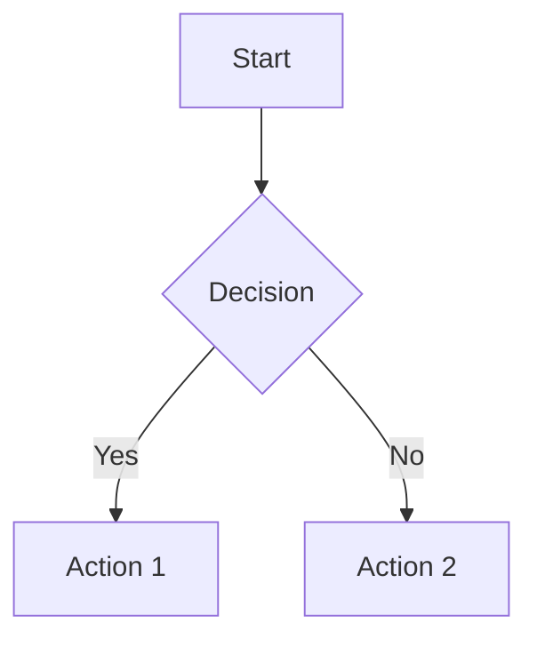

# Markdown to PDF/HTML/Word Converter with Mermaid Support

## Installation

### 1. Create Virtual Environment (Recommended)

#### Windows:

```batch
# รันไฟล์ setup script
setup_venv.bat

# หรือสร้างด้วยตนเอง
python -m venv markdown_converter_env
markdown_converter_env\Scripts\activate.bat
pip install -r requirements.txt
```

#### Linux/macOS:

```bash
# รันไฟล์ setup script
chmod +x setup_venv.sh
./setup_venv.sh

# หรือสร้างด้วยตนเอง
python3 -m venv markdown_converter_env
source markdown_converter_env/bin/activate
pip install -r requirements.txt
```

### 2. Install Python Dependencies (Without Virtual Environment)

```bash
pip install -r requirements.txt
```

### 3. Install System Dependencies (Optional)

For better PDF generation, install these system tools:

#### Windows:

```bash
# Install pandoc
winget install --id JohnMacFarlane.Pandoc

# Install wkhtmltopdf
winget install --id wkhtmltopdf.wkhtmltopdf
```

#### macOS:

```bash
# Install pandoc
brew install pandoc

# Install wkhtmltopdf
brew install wkhtmltopdf
```

#### Linux (Ubuntu/Debian):

```bash
# Install pandoc
sudo apt-get install pandoc

# Install wkhtmltopdf
sudo apt-get install wkhtmltopdf
```

## Usage

### GUI Application (แนะนำสำหรับผู้ใช้ทั่วไป)

#### Windows:

```batch
# ดับเบิลคลิกที่ไฟล์
run_gui.bat

# หรือรันใน Command Prompt:
run_gui.bat
```

#### Linux/macOS:

```bash
# ให้สิทธิ์ execute และรัน
chmod +x run_gui.sh
./run_gui.sh
```

### Command Line Interface

#### Activate Virtual Environment

##### Windows:

```batch
# เปิดใช้งาน virtual environment
markdown_converter_env\Scripts\activate.bat

# หรือใช้ไฟล์ activate_env.bat
activate_env.bat
```

##### Linux/macOS:

```bash
# เปิดใช้งาน virtual environment
source markdown_converter_env/bin/activate
```

#### Basic Usage

```bash
# Convert to HTML
python main.py input.md --format html --output output.html

# Convert to PDF
python main.py input.md --format pdf --output output.pdf

# Convert to Word
python main.py input.md --format word --output output.docx
```

### Advanced Usage

```bash
# Convert to all formats
python main.py input.md --format all --output-dir ./output/

# Specify document title
python main.py input.md --format pdf --output output.pdf --title "My Document"

# Skip Mermaid diagram processing
python main.py input.md --format html --output output.html --no-images
```

### Command Line Options

- `input_file`: Path to input Markdown file (required)
- `--format, -f`: Output format (`pdf`, `html`, `word`, `all`) (default: `html`)
- `--output, -o`: Output file path (required for single format)
- `--output-dir, -d`: Output directory (required for `all` format)
- `--title, -t`: Document title (default: "Document")
- `--no-images`: Skip Mermaid diagram processing

## Features

### Supported Markdown Features

- Headers (H1-H6)
- Bold and italic text
- Lists (ordered and unordered)
- Tables
- Code blocks with syntax highlighting
- Blockquotes
- Links and images
- Table of contents (TOC)

### Mermaid Diagram Support

The converter automatically detects and processes Mermaid diagrams in your Markdown files:

````markdown

````

````

Supported Mermaid diagram types:
- Flowcharts
- Sequence diagrams
- Gantt charts
- Class diagrams
- State diagrams
- And more...

### Output Formats

#### HTML
- Clean, responsive design
- Syntax highlighting for code blocks
- Table of contents
- Embedded Mermaid diagrams as images

#### PDF
- Professional formatting
- High-quality Mermaid diagram rendering
- Print-ready layout
- Customizable styling

#### Word (.docx)
- Editable document format
- Preserved formatting
- Embedded images
- Compatible with Microsoft Word

## Examples

### Example 1: Convert KPI Visualization

```bash
python main.py ../service_version1/kpi_visualization.md --format all --output-dir ./output/ --title "KPI Visualization Report"
````

This will create:

- `output/kpi_visualization.html`
- `output/kpi_visualization.pdf`
- `output/kpi_visualization.docx`

### Example 2: Convert Single Format

```bash
python main.py ../service_version1/kpi_visualization.md --format pdf --output kpi_report.pdf --title "KPI Analysis Report"
```

## Troubleshooting

### Common Issues

1. **Mermaid diagrams not rendering**

   - Check internet connection (uses Mermaid.ink API)
   - Use `--no-images` flag to skip diagram processing

2. **PDF generation fails**

   - Install weasyprint: `pip install weasyprint`
   - Or install pandoc and wkhtmltopdf as system dependencies

3. **Word document creation fails**

   - Install pandoc: `pip install pandoc` or system installation

4. **Encoding issues**
   - Ensure your Markdown file is saved as UTF-8
   - Use `--no-images` if diagram processing causes issues

### Performance Tips

- For large files with many diagrams, consider using `--no-images` for faster processing
- Use `--format all` to generate all formats in one run
- Process multiple files using shell scripts or batch files

## Development

### Project Structure

```
export_markdown/
├── main.py              # Main application
├── requirements.txt     # Python dependencies
├── README.md           # This file
└── examples/           # Example files (optional)
```

### Adding New Features

1. Extend the `MarkdownConverter` class for new output formats
2. Add new diagram processors in `MermaidProcessor` class
3. Update command line arguments in `main()` function

### Testing

```bash
# Test with sample file
python main.py ../service_version1/kpi_visualization.md --format all --output-dir ./test_output/
```

## License

This project is open source and available under the MIT License.

## Support

For issues and questions:

1. Check the troubleshooting section above
2. Verify all dependencies are installed correctly
3. Test with a simple Markdown file first
4. Check the console output for error messages
